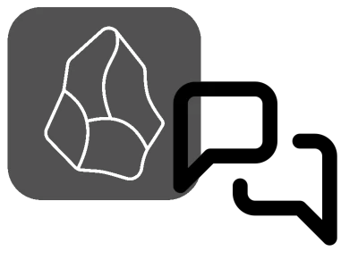

# Obsidian LLM notes

<div style="text-align: center" align="center">



</div>

LLM notes is an Obsidian plugin that integrates **private** and **local** large language models (LLMs) to enhance:

- Search via text embeddings
- Synthesis via chat-like interactions
- Note similarity via semantic similarity
- Summarization via retrieval-based methods

## Limitations

- Currently, this plugin must be installed manually. There are a few issues with dependencies that I need to resolve before I can publish it to the Obsidian community plugins service.
- **Only ollama will be supported** for LLM interactions. This greatly reduces the complexity of this plugin.
- Redis is required to store vector embeddings of each note - without it, the plugin will not work.
- There aren't sophisticated error handling procedures in place yet. The process of setting up the plugin may be difficult or confusing.

## Installation and requirements

### Install the plugin for use

1. Download the release files from the [releases page](https://github.com/wingillis/obsidian-llm-notes/releases) and place them in your Obsidian vault's `.obsidian/plugins` directory. The 2 files you need are:
   - `manifest.json`
   - `main.js`
2. Make sure you have Redis installed and running. [See below](#redisdocker) for instructions on how to set up Redis with Docker.
3. Make sure you have `ollama` installed and running. [See below](#ollama) for instructions on how to set up `ollama`.
4. When you first start up Obsidian and enable the plugin, you need to go to the settings tab, select a language model and embedding model, and click the "Start plugin" button.

### Install the plugin for development

1. Clone this repository to your local machine.
2. Make sure node/npm is installed on your system.
3. Run `npm install` in the root directory of the repository.
4. Run `npm run dev` to compile the plugin and continuously watch for file changes.

Note: each time you make a change to the plugin, you need to refresh the plugin within the Obsidian app to see the changes.
Obsidian recommends installing the "hot reload" plugin to automate this process.

### Redis/Docker

Redis is a performant vector database that LLM notes uses to store note embeddings.

1. Install Docker on your system.
2. Run the following command in your terminal to create and start a Redis container:

```bash
docker run -p 6379:6379 -d -e REDIS_ARGS="--requirepass obsidian" -v ./redis-data:/data --restart unless-stopped --name redis redis/redis-stack-server:latest
```

This command creates a Redis container with the password `obsidian` and mounts to a local folder (`redis-data/`) to save the database locally.
Mounting a local folder is optional, but it's useful if you delete or switch between Redis containers.
Whenever you quit and re-open docker, the redis container will automatically restart.

### ollama

1. Follow the installation instructions for `ollama` [here](https://ollama.com/download).
If on a Mac, you can also install `ollama` with [Homebrew](https://formulae.brew.sh/formula/ollama) `brew install ollama`.
2. Run the server if it's not already running: `ollama serve`. I prefer to use flash attention when running the server:

```bash
OLLAMA_FLASH_ATTENTION=true ollama serve
```

3. Download a language and embedding model of your choice.
I recommend `llama3.2` for your LLM and `nomic-embed-text` or `snowflake-arctic-embed:137m` for your embedding model.

```bash
# in a new terminal window while "ollama serve" is running
ollama pull nomic-embed-text  # or ollama pull snowflake-arctic-embed:137m
ollama pull llama3.2  # downloads the 3b version
```

## Features

### Search

Input a keyword, phrase, or question to search for the most relevant notes in your Obsidian vault.

The search feature opens a modal that allows you to use keywords, phrases, or questions to search for the most relevant notes in your Obsidian vault.
Open the modal from the command palette.

### Chat

Chat with an LLM that has access to your Obsidian vault.

Using the Chat view, you can interact with your notes in a few supported ways:

1. using the `@workspace` command to select the most relevant notes in your Obsidian vault to respond to your query.
2. by inserting links to individual files from your Obsidian vault using the wikilinks syntax, i.e. `[[folder/note_path]]`.

**Note**: you can use only one of these methods at a time.

All chats are stored in the `llm-chat` folder in your Obsidian vault.
You can change this folder in the settings.
Saved chats are ignored by LLM notes.

#### The `@workspace` command

When you type `@` in the chat view, a window will pop up, showing the currently supported keyword commands (which is only `@workspace` at the moment).
Clicking on the keyword will insert it into the chat.
Alternatively, pressing `tab` will insert the top-most keyword from the window into the chat.
Typing `@workspace` will enable the chat to integrate the most relevant notes from your Obsidian vault into the prompt sent to the LLM, and enhance the quality of model's response.

#### Linking to files

When you type `[[` in the chat view, a window will pop up, showing a list of all notes that contain the characters you've typed so far.
Clicking on a note will insert a link to that note in the chat.
Alternatively, pressing `tab` will insert the top-most note from the window into the chat.
Linking to notes will add the entire contents of the linked note to the prompt sent to the LLM, allowing you to interact with the note's contents.

### Similar notes

View the most similar notes to the current note based on semantic similarity.

This feature opens a view that shows the most similar notes to the current note.

### First-time setup

The first time you use the plugin, it will connect to your redis instance and populate the database to store note embeddings and metadata.
The embedding generation process can take a long time, because I implemented a poor-man's version of [Anthropic's contextual retrieval technique](https://www.anthropic.com/news/contextual-retrieval) to improve RAG output.

If you don't want to use this feature, you can disable it in the settings.

### Command palette

LLM chat adds a few commands to the command palette:

- **Embedding-based file search**: opens a modal to allow the user to use keywords, phrases, or questions to search for the most relevant notes in their Obsidian vault.
- **Chat with LLM**: opens a chat view to interact with the LLM.
- **Similar notes**: opens a a view to show the most similar notes to the current note.
- **New chat**: begins a new chat session with the LLM.
- **Summarize note**: begins a new chat session where the first response from the LLM summarizes the current note.

## Future directions

Some ideas I have for future development:

- Add `@folder` command to chat
- Better error handling
- PDF support

I may not have time to implement these features. If you're interested in contributing, feel free to fork this repository and add them yourself.

## Comparison to other plugins

There are already several plugins that exist for Obsidian that integrate with LLMs, such as [Smart Connections](https://github.com/brianpetro/obsidian-smart-connections)
and [Smart Second Brain](https://github.com/your-papa/obsidian-Smart2Brain).
I'm not attempting to compete or replace these plugins, although we all offer similar features.
However, there are a few key differences between LLM notes and these plugins:

- **Privacy**: LLM notes is designed to work **only** offline with local LLMs and does not support any cloud-based LLMs.
- **Clear organization**: LLM notes is designed to be simple and focused, with few installation dependencies. If there is a feature you want implemented, I hope that you can easily fork this repository and add it yourself.
- **Exposed LLM pipeline**: The search and chat features are not hidden behind `langchain` or API calls. The pipeline used is clearly defined in the code, and can be easily modified to experiment with more sophisticated approaches.
